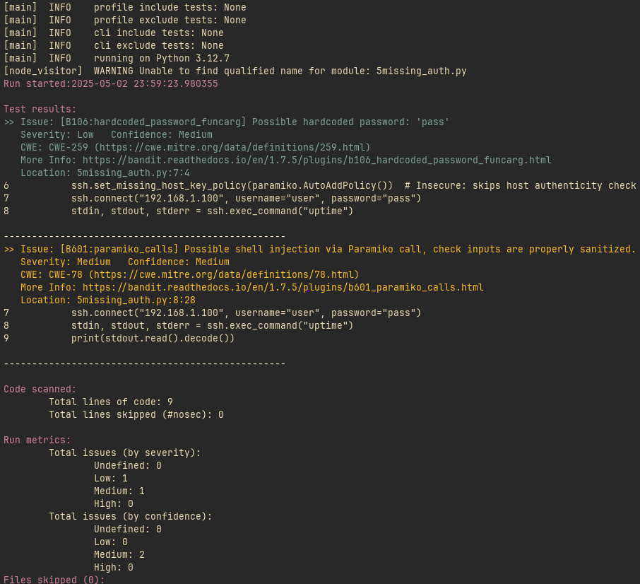

# Bandit Tutorial 

## Video Tutorial
[:max_bytes(150000):strip_icc():focal(299x0:301x2)/rick-astley-600-d31de1cb3fb248e6b714e5fa789b104d.jpg)](https://www.youtube.com/watch?v=dQw4w9WgXcQ)

## Table of Contents 
- [Bandit Tutorial](#bandit-tutorial)
  - [Video Tutorial](#video-tutorial)
- [1 Introduction](#1-introduction)
- [2 Installation and Containerization](#2-installation-and-containerization)
  - [2.1 Installation](#21-installation)
  - [2.2 Containerization](#22-containerization)
- [3 Usage](#3-usage)
- [4 Integration and Plugins](#4-integration-and-plugins)
  - [4.1 Visual Studio Code](#41-visual-studio-code)
  - [4.2 Vim/Neovim](#42-vimneovim)
  - [4.3 Github Actions](#43-github-actions)
  - [4.4 Test Plugins](#44-test-plugins)
- [5 Examples](#5-examples)
  - [5.1 Example 1: Arbitrary Code Execution](#51-example-1-arbitrary-code-execution)
  - [5.2 Example 2: Insecure File Permissions](#52-example-2-insecure-file-permissions)
  - [5.3 Example 3: Weak Cryptography](#53-example-3-weak-cryptography)
  - [5.4 Example 4](#54-example-4)
  - [5.5 Example 5: Insecure SSH Login](#55-example-5-insecure-ssh-login)
- [6 Future Use and Limitations](#6-future-use-and-limitations)
  - [6.1 Future Use](#61-future-use)
  - [6.2 Limitations](#62-limitations)

# 1 Introduction

# 2 Installation and Containerization
## 2.1 Installation

Note: If you are using Python 3, you may need to use `pip3` and `python3` instead of `pip` and `python`.

Bandit is incredibly easy to install. You can use pip to install it globally or in a virtual environment. Here are the commands to install Bandit:

```bash
pip install bandit
```

To install it with TOML support, the SARIF output formatter, or the bandit CLI,
you can run the following commands, respectively:

```bash
# These are kind of irrelevant, but you can install them if you want to use them.

pip install bandit[toml]

pip install bandit[sarif]

pip install bandit[baseline]
```

You can also install Bandit from source by cloning the repository and running the following command:

```bash
git clone https://github.com/PyCQA/bandit.git
cd bandit

python setup.py install
```

## 2.2 Containerization

Bandit can be run in a Docker container. This is useful if you want to run Bandit in a clean environment or if you want to run it on a different machine. Here are the commands to run Bandit in a Docker container:

```bash
docker pull ghcr.io/pycqa/bandit/bandit

# This command will run Bandit in a Docker container and mount the current directory to /src in the container.
# It will then run Bandit recursively on the /src directory.
docker run -v $(pwd):/src ghcr.io/pycqa/bandit/bandit bandit -r /src

# To run Bandit in a Docker container and only scan a specific file, you can use the following command:
docker run -v $(pwd):/src ghcr.io/pycqa/bandit/bandit bandit /src/myfile.py
```

Note: The supported architectures for the Docker image are amd64, arm64, armv7 and armv8.

# 3 Usage

# 4 Integration and Plugins
## 4.1 Visual Studio Code

Note: This might just not work on Windows... I only got it working well on Linux and MacOS.

Bandit can be integrated into Visual Studio Code using the Bandit extension. This extension allows you to run Bandit on your code and view the results in the editor. Here are the steps to install and use the Bandit extension in Visual Studio Code:
1. Open Visual Studio Code and go to the Extensions view by clicking on the Extensions icon in the Activity Bar on the side of the window.
2. Search for ["Bandit by PyCQA"](https://marketplace.visualstudio.com/items?itemName=pycqa.bandit-pycqa) in the Extensions view search bar.
3. Click on the "Install" button to install the Bandit extension.
4. When you save your code, the Bandit extension will automatically run Bandit on your code and display the results in the Problems view as well as in the file itself with inline annotations.

See screenshot:


## 4.2 Vim/Neovim

## 4.3 Github Actions

You can use Bandit in GitHub Actions to automatically run Bandit on your code when you push changes to your repository. Here is an example of how to set up Bandit in GitHub Actions:
```yaml
name: Bandit

on:
  workflow_dispatch:

jobs:
  analyze:
    runs-on: ubuntu-latest
    permissions:
      # required for all workflows
      security-events: write
      # only required for workflows in private repositories
      actions: read
      contents: read
    steps:
      - name: Perform Bandit Analysis
        uses: PyCQA/bandit-action@v1
```

Simply create a `.github/workflows/bandit.yml` file in your repository and add the above code to it. This will run Bandit on your code every time you push changes to your repository.

## 4.4 Test Plugins

Bandit allows you to write your own plugins to check for specific security issues in your code. You can create a new plugin by creating a new Python file in the `bandit/plugins` directory. Here is an example of a simple Bandit plugin:

```python
import bandit
from bandit.core import issue
from bandit.core import test_properties as test


def exec_issue():
    return bandit.Issue(
        severity=bandit.MEDIUM,
        confidence=bandit.HIGH,
        cwe=issue.Cwe.OS_COMMAND_INJECTION,
        text="Use of exec detected.",
    )


# Call is the python AST node type for function calls
@test.checks("Call") # Denotes its a function call that we are looking for
@test.test_id("B102") # B1xx is a misc test, and B102 is specific to exec
def exec_used(context):
    if context.call_function_name_qual == "exec":
        return exec_issue()
```

This plugin checks for the use of the `exec` function in your code and raises an issue if it is found.

[Heres the existing list of plugins that are already included in Bandit.](https://bandit.readthedocs.io/en/latest/plugins/index.html#complete-test-plugin-listing) 

# 5 Examples
## 5.1 Example 1: Arbitrary Code Execution

```python
def run_user_script():
  script = input("Enter Python script: ")
  print("Running script...")
  exec(script)
  print("Script finished running.")

run_user_script()
```

This code is vulnerable to code injection attacks. An attacker can input a malicious Python script that will be executed by the `exec` function. This can lead to arbitrary code execution and compromise the security of the system.

Here is an example of how to run Bandit on this code, as well as the actual output:
```bash
bandit examples/1ace.py
```

Output:


## 5.2 Example 2: Insecure File Permissions

```python
import os

def save_credentials_insecure():
    credentials = "username=admin\npassword=P@ssw0rd!\n"
    filepath = "credentials.txt"

    with open(filepath, "w") as f:
        f.write(credentials)

    os.chmod(filepath, 0o777)

    print(f"Credentials saved to {filepath} with world-readable permissions.")

save_credentials_insecure()
```

This code is vulnerable to insecure file permissions. The `os.chmod` function sets the file permissions to be readable, writable, and executable by anyone. This can lead to unauthorized access to sensitive information.

Here is an example of how to run Bandit on this code, as well as the actual output:
```bash
bandit examples/2ace.py
```

Output:


## 5.3 Example 3: Weak Cryptography

```python
import hashlib

def store_password_md5(password):
    hash_value = hashlib.md5(password.encode()).hexdigest()
    print(f"Password hash stored as: {hash_value}")

user_password = input("Enter your password: ")
store_password_md5(user_password)
```

This code is vulnerable due to using the MD5 hashing algorithm for password storage. MD5 is considered weak and can be easily cracked by attackers. It is recommended to use a stronger hashing algorithm, such as bcrypt or Argon2, for password storage.

Here is an example of how to run Bandit on this code, as well as the actual output:
```bash
bandit examples/3bad_crypto.py
```

Output:


## 5.4 Example 4

```python
import socket

def start_server():
    server = socket.socket(socket.AF_INET, socket.SOCK_STREAM)
    server.bind(("0.0.0.0", 9090))
    server.listen(5)
    print("Server listening on port 9090...")
    conn, addr = server.accept()
    print(f"Connection from {addr}")
    conn.send(b"Hello!\n")
    conn.close()

start_server()
```

This is information disclosure.

Here is an example of how to run Bandit on this code, as well as the actual output:
```bash
bandit examples/4socket.py
```

Output:


## 5.5 Example 5: Insecure SSH Login

```python
import paramiko

def insecure_ssh_login():
    ssh = paramiko.SSHClient()
    ssh.set_missing_host_key_policy(paramiko.AutoAddPolicy())
    ssh.connect("192.168.1.100", username="user", password="pass")
    stdin, stdout, stderr = ssh.exec_command("uptime")
    print(stdout.read().decode())
    ssh.close()

insecure_ssh_login()
```

This code has multiple vulnerabilities:
1. It uses the `AutoAddPolicy` for SSH connections, which automatically adds the host key without verifying it. This can lead to connecting to a malicious server. Notice that Bandit does not flag this as a vulnerability, but it is a security risk.
2. ssh.exec_command is used to execute a command on the remote server, which can be exploited if the command is not properly sanitized. An attacker could inject malicious commands into the `exec_command` function.
3. It has a hardcoded password, which is a security risk. Hardcoding passwords in code can lead to unauthorized access if the code is exposed or shared.

Here is an example of how to run Bandit on this code, as well as the actual output:
```bash
bandit examples/5ssh.py
```

Output:


# 6 Future Use and Limitations
## 6.1 Future Use

## 6.2 Limitations
